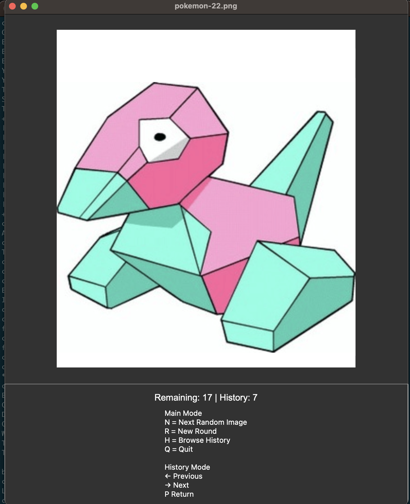

# Bingo Caller for Cards with Images

*Note* - this repository was assisted by ChatGPT technology

If you're using custom Bingo cards with images this caller generator is for your! This python desktop application can be used to displaying images at random without repeats during a bingo round. The current setup is based off:
* [Pokemon Bingo Cards 1](https://www.teacherspayteachers.com/Product/Pokemon-Bingo-30-Boards-25-Pictures-16028119) - Images in local directory `pokemon-1`
  * Center image is the "Free Space" so there will be no generated image for it 
* [Pokemon Bingo Cards 2](https://www.teacherspayteachers.com/Product/Pokemon-Bingo-30-Boards-25-Pictures-16028119) - Images in local directory `pokemon-2`
  * Center image is the "Free Space" so there will be no generated image for it

Your choice of images are loaded automatically from a configured directory, and previously shown images within the current round can be reviewed using a history browser.



## Features

* Load images from a configured directory
  * Automatic discovery of image files in subdirectories
* Random image selection with a counter of how many have been shown during the current round
* No duplicate images within a round
* Start a new round at any time
* Option to Browse previously shown images
* Keyboard-driven interface

## Related Docs
For tests see: [testing.md](/testing.md). For details on the application structure see [architecture](/architecture.md)

---

# Requirements

## Python

Python 3.14 or newer is recommended.

## Dependencies

Install required packages:

```bash
pip install pillow pyyaml
```

Or run:
```bash
python -m pip install -r requirements.txt
```
If you have multiple python versions installed:
```bash
python3 -m pip install -r requirements.txt
```
---

# Configuration

The application uses an `images.yaml` file located in the same directory as `app.py` that defines where the images are for the bingo caller. You can configure the relative or absolute path of the image directory.

Below is an example of defining the image from the relative path of the project. Relative paths are resolved from the location of `app.py`.

```yaml
image_directory: pokemon-1
```

This tells the application to load all supported image files from the `pokemon-1` directory.

Full path examples `macOS / Linux`:

```yaml
image_directory: /Users/username/path/to/images
```

`Windows`:

```yaml
image_directory: C:\Users\username\path\to\images
```
## Supported Image Formats

The application automatically loads:

* PNG (`.png`)
* JPEG (`.jpg`, `.jpeg`)
* GIF (`.gif`)
* BMP (`.bmp`)
* WebP (`.webp`)

Image discovery is recursive, meaning images contained in subdirectories are automatically included.

---

# Running the Bingo Caller Application

From the project directory:

```bash
python app.py
```
or
```bash
python3 app.py
```

---

# Controls

## Main Mode

| Key | Action                 |
| --- | ---------------------- |
| R   | Start a new round      |
| N   | Show next random image |
| H   | Browse image history   |
| Q   | Quit application       |

### Round Behavior

When a round starts:

1. All images become eligible.
2. Images are shuffled randomly.
3. Each image is shown at most once during the round.
4. When all images have been shown, the round is complete.
5. Press `R` to begin a new round.

---

## History Mode

Press `H` while in Main Mode.

| Key | Action              |
| --- | ------------------- |
| ←   | Previous image      |
| →   | Next image          |
| P   | Return to Main Mode |

History contains all images shown during the current round.

### Example Round

1. Launch the application using `python app.py` or `python3 app.py`
2. Press: `R` to start a round.
3. A random image appears.
4. Press: `N` to display another random image.
5. Press: `H` to review images already shown.
6. Press `←`(Previous) | `→` (Most Recent) to move through image history.
7. Press: `P` to return to Main Mode.
8. When all images have been shown or to start a new round, press: `R`

The history counter should reset to 1 and a starting image of the new round is displayed

# Troubleshooting
## "Image directory does not exist"
Verify that the path specified in `images.yaml` is correct.

Example with starting directory: `image_directory: pokemon-1`

Ensure the directory actually exists:

```text
bingo-caller/
├── app.py
├── images.yaml
└── pokemon-1/
...
```

## "No images found"

Verify that the configured directory contains supported image file types.

## Images appear too large or too small

Images are dynamically scaled based on the current window size.

The application automatically:
- Preserves aspect ratio
- Reserves space for status and help controls
- Adjusts image size when the window is resized

For larger image viewing, maximize the application window.

# Future Enhancements - Whenever I get free time from parenting

Potential future improvements:

* Multiple image directories
* Image categories and tags
* Persistent history between sessions
* Slideshow mode
* Guess-before-reveal mode
* Favorites and ratings
* Full-screen display
* Smoother dynamic rendering when resizing the window

